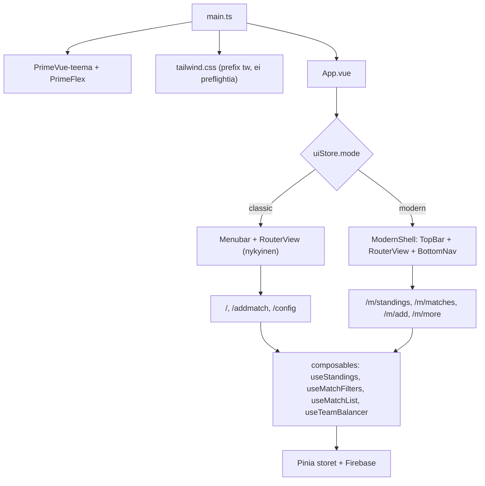

# Uusi käyttöliittymä – toteutussuunnitelma

Tavoitteena on rakentaa hanastatsille moderni, mobiilissa käytettävä ja saavutettava käyttöliittymä ilman että nykyinen PrimeVue-pohjainen käyttöliittymä rikkoutuu. Molemmat käyttöliittymät ovat käytettävissä rinnakkain, ja niiden välillä vaihdetaan yläreunan pikatogglella.

## Lähtötilanne

Sovellus on Vue 3 + Vite + Pinia + Firebase Realtime Database. Käyttöliittymä koostuu kolmesta näkymästä:

- [src/views/Stats.vue](src/views/Stats.vue) (622 riviä): suodattimet, standings-taulukko, ELO-graafi, matsilista ja sekalaiset tilastot neljässä accordionissa
- [src/views/AddMatch.vue](src/views/AddMatch.vue): pelin valinta, tiimimoodi, pelaajavalinta, tulokset, ennuste
- [src/views/Config.vue](src/views/Config.vue): pelaajat, pelit, tiimit, välimuistin invalidointi

Ulkoasu tulee PrimeVue 3 -komponenteista, PrimeFlex-utilityistä ja PrimeVuen `md-dark-indigo`-teemasta. Fonttina on FixedSys, joka pakotetaan globaalisti tiedostossa [src/assets/main.css](src/assets/main.css).

### Tekninen rajoite, joka ohjaa koko toteutusta

PrimeFlexin utility-luokat käyttävät `!important`-määrettä ja törmäävät nimiltään Tailwindiin, mutta eri arvoilla:

| Luokka | PrimeFlex | Tailwind |
| --- | --- | --- |
| `mt-3` | 1rem | 0.75rem |
| `gap-3` | 1rem | 0.75rem |
| `p-3` | 1rem | 0.75rem |
| `w-6` | 50% | 1.5rem |
| `text-4xl` | 2rem | 2.25rem |

Koska PrimeFlex pakottaa `!important` ja Tailwind v4 sijoittaa utilityt cascade-layeriin, Tailwind ei pysty voittamaan PrimeFlexiä missään tilanteessa. Prefixaamaton Tailwind ei siis ole vaihtoehto niin kauan kuin PrimeFlex on ladattuna.

## Lukitut päätökset

1. **Tailwind prefixillä**: `@import "tailwindcss" prefix(tw)`, luokat muodossa `tw:flex`, `tw:md:grid`, `tw:hover:bg-…`. Nollariski törmäyksille molempiin suuntiin ja toggle toimii ilman sivun uudelleenlatausta.
2. **Laskentalogiikka jaetaan**: standings-, suodatus- ja tiimitasapainologiikka nostetaan composableiksi, joita myös vanhat näkymät käyttävät. Yksi totuus ELO- ja pistelaskennalle.
3. **Modern on oletusmoodi** uusille käyttäjille, classic on saatavilla togglella.
4. **FixedSys jää pois uudesta käyttöliittymästä**, vanhassa se säilyy ennallaan.

### Seuraukset

**Preflight täytyy jättää pois.** Tailwindin Preflight nollaa otsikoiden marginaalit, poistaa listojen bulletit ja resetoi reunat globaalisti, mikä muuttaisi vanhoja näkymiä. Tuodaan Tailwind osina:

```css
@layer theme, base, components, utilities;
@import "tailwindcss/theme.css" layer(theme) prefix(tw);
@import "tailwindcss/utilities.css" layer(utilities) prefix(tw);
```

Omat pohjatyylit rajataan uuden käyttöliittymän juureen `[data-ui="modern"]`-valitsimella, jolloin ne eivät vuoda vanhaan puoleen. PrimeVuen teema määrittelee jo `* { box-sizing: border-box }`, joten sitä ei tarvitse toistaa.

**FixedSysin poisto ei vaadi muutoksia vanhaan CSS:ään.** `main.css` asettaa `:root, html { font-family: 'FixedSys' !important }`, mutta periytyvä arvo häviää aina elementtiin itseensä kohdistuvalle säännölle, joten uuden UI:n juureen asetettu fonttipino riittää.

**Teematokenit kirjoitetaan `@theme`-lohkoon ilman prefixiä** ja niistä generoituu `--tw-`-alkuiset CSS-muuttujat.

**`tw:`-etuliitteen kohina keskitetään komponentteihin.** Näkymät kootaan pääosin valmiista primitiiveistä, joten utilityjä kirjoitetaan käsin lähinnä komponenttikirjastossa.

## Arkkitehtuuri



Vanhat reitit säilyvät koskemattomina ja uudet tulevat `/m/*`-puuhun. URL kertoo aina kumpi käyttöliittymä on käytössä, deep linkit toimivat, eikä reititykseen tarvita ehdollista komponenttien vaihtoa.

### Hakemistorakenne

```
src/
  ui/
    styles/tailwind.css        Tailwind-importit, @theme-tokenit, [data-ui="modern"] -pohjatyylit
    components/                omat primitiivit (UiButton, UiSegmented, ...)
    icons/                     inline-SVG-ikonit
    layout/                    ModernShell, TopBar, BottomNav, UiModeToggle
    views/                     StandingsView, MatchesView, AddMatchView, MoreView
    features/                  StandingsTable, MatchCard, FilterSheet, PlayerPicker, ...
  composables/                 useStandings, useMatchFilters, useMatchList, useTeamBalancer
  stores/ui.ts                 UI-moodi localStoragessa
```

## Vaiheet

### Vaihe 0: perusta ja regressiosuoja

Haara `feat/modern-ui`. Otetaan kuvakaappaukset vanhasta käyttöliittymästä (stats mobiili ja desktop, addmatch, config) ja talletetaan standings-taulukon luvut, jotta vaiheen 4 logiikkasiirron muuttumattomuus voidaan todistaa.

### Vaihe 1: Tailwind, tokenit ja UI-moodi

- `yarn add tailwindcss @tailwindcss/vite`
- [vite.config.ts](vite.config.ts): lisätään `tailwindcss()` plugineihin
- Uusi `src/ui/styles/tailwind.css`: Tailwind-importit ilman preflightia, `@theme`-tokenit (pinnat, tekstit, reunat, aksentti, voitto- ja häviövärit, radiukset, varjot, fonttiperheet, tekstikoot) sekä `[data-ui="modern"]`-rajatut pohjatyylit (typografia, taustaväri, `:focus-visible`, minimikosketusalueet)
- [src/main.ts](src/main.ts): uuden tyylitiedoston import
- Uusi `src/stores/ui.ts`:

```ts
export const useUiStore = defineStore('ui', () => {
  const mode = ref<'classic' | 'modern'>(readStoredMode() ?? 'modern');
  watch(mode, value => localStorage.setItem('hanastats-ui-mode', value));
  return { mode };
});
```

- [index.html](index.html): `viewport-fit=cover` ja `theme-color`

Vaiheen lopuksi varmistetaan että classic-näkymät ovat pikselintarkasti ennallaan.

### Vaihe 2: komponenttikirjasto

Omat komponentit hakemistoon `src/ui/components/`, ei yhtään PrimeVue-riippuvuutta:

| Komponentti | Korvaa | Huomiot |
| --- | --- | --- |
| `UiButton` | `p-button` | variantit primary/ghost/danger, koot sm/md/lg, loading-tila |
| `UiIconButton` | ikonipainikkeet | pakotettu 44x44px kosketusalue |
| `UiSegmented` | `SelectButton` | yksi- ja monivalinta, `role="group"` ja `aria-pressed` |
| `UiRadioGroup` | `RadioButton` | natiivi `input[type=radio]`, nuolinäppäintuki |
| `UiCheckbox` | `Checkbox` | natiivi input, custom visuaali |
| `UiSwitch` | `InputSwitch` | `role="switch"` ja `aria-checked` |
| `UiSelect` | `Dropdown` | natiivi `select`, mobiilin oma valitsin |
| `UiStepper` | TeamScoren napit | isot +/- napit, `aria-live` maalimäärälle |
| `UiSheet` | – | alhaalta nouseva paneeli suodattimille, focus trap, Esc sulkee |
| `UiCollapsible` | `Accordion` | `button` + `aria-expanded`, ei div-klikkejä |
| `UiCard`, `UiBadge`, `UiSpinner`, `UiSkeleton`, `UiEmptyState` | – | perusrakennuspalikat |
| `UiTable` | `DataTable` | sarakekonfiguraatio propsina, prioriteettipohjainen responsiivisuus |

Lisäksi inline-SVG-ikonit hakemistoon `src/ui/icons/` ja kehitysaikainen kitchen-sink -näkymä, jossa kaikki komponentit näkyvät kaikissa tiloissa yhdellä sivulla.

### Vaihe 3: shell, navigaatio ja pikatoggle

- `ModernShell`: yläpalkki, sisältöalue ja alanavigaatio
- `BottomNav`: standings, matches, add (vain adminille), more. Kiinteä alareunaan, `env(safe-area-inset-bottom)` huomioituna, `aria-current="page"`, ikoni ja tekstilabel, vähintään 44px korkeat kohteet
- `UiModeToggle` yläpalkkiin: segmentoitu classic/modern-kytkin, joka vaihtaa moodin ja ohjaa vastaavaan reittiin ilman uudelleenlatausta
- [src/router/index.ts](src/router/index.ts): uudet `/m/*`-reitit `ModernShell`-layoutin lapsina, juurireitti ohjaa tallennetun moodin mukaan, `?ui=classic|modern` ohittaa tallennetun arvon
- [src/App.vue](src/App.vue): valitsee shellin moodin perusteella ja asettaa `data-ui`-attribuutin

### Vaihe 4: laskentalogiikan jakaminen

Nostetaan [src/views/Stats.vue](src/views/Stats.vue):sta ja [src/views/AddMatch.vue](src/views/AddMatch.vue):sta composableiksi:

- `useMatchFilters`: peli-, pelaajamäärä-, kuukausi- ja samassa joukkueessa -suodattimet
- `useStandings`: standings-rivien laskenta, sarjapisteet, putket, ELO
- `useMatchList`: matsilista, ELO-muutokset, järjestys
- `useTeamBalancer`: elo-pohjainen ja satunnainen joukkuejako

Myös vanhat näkymät refaktoroidaan käyttämään näitä, jotta laskenta ei haaraudu kahdeksi totuudeksi. Vanhojen näkymien ulkoasu ja käyttäytyminen pysyvät identtisinä. Samalla korjataan tehottomuus: `calculateEloRatings` ajetaan nyt kahdesti (`matches`- ja `standings`-computedeissa), composable laskee sen kertaalleen. Vaiheen hyväksyntä: vaiheen 0 vertailuluvut täsmäävät.

### Vaihe 5: standings-näkymä

Responsiivinen taulukko yhdestä sarakekonfiguraatiosta, jossa jokaisella sarakkeella on prioriteetti:

| Näyttö | Sarakkeet |
| --- | --- |
| Mobiili | pelaaja ja badget, gp, w-l yhdistettynä, p%, elo |
| md ja isommat | edelliset sekä l, ot, d (kun peli antaa pisteitä tasapelistä), g-diff |
| lg ja isommat | edelliset sekä pisteet, maksimipisteet, gf, ga, voitto-%, viimeiset viisi tulosta |

Tarttuva otsikkorivi ja tarttuva pelaajasarake, `tabular-nums`-numerot, rivin napautus avaa yksityiskohdat oikeana `aria-expanded`-painikkeena, sarakeotsikoista lajittelu. Suodattimet siirtyvät `UiSheet`-paneeliin ja aktiiviset suodattimet näkyvät poistettavina chippeinä, mikä poistaa nykyisen ongelman jossa viisi `SelectButton`-riviä täyttää mobiiliruudun. ELO-graafi saa oman togglen ja mobiilikorkeuden; nykyinen kiinteä 500px korkeus ja päälle piirtyvä legenda eivät toimi puhelimessa.

### Vaihe 6: matches-näkymä

Omat matsikortit: päivä, peli, koti- ja vierasjoukkue, tulos, OT-merkintä. Voittaja korostetaan värin lisäksi tekstillä tai ikonilla. Nykyinen lista renderöi kaikki 891 matsia kerralla, joten lisätään sivutus tai virtuaaliscroll sekä pelaajahaku. ELO-muutokset avautuvat kortin sisään.

### Vaihe 7: add match -näkymä

Peli `UiSelect`-valitsimella, tiimimoodi `UiRadioGroup`illa, pelaajat isoina chippeinä, tulokset isoilla askeltimilla peukalon ulottuvilla, ennustepaneeli korttina. Lähetysnappi kiinteänä toimintopalkkina alanavigaation yläpuolella, latausindikaattori ja onnistumisilmoitus.

### Vaihe 8: more-näkymä

Config-toiminnot (pelaajat, pelit, tiimit, välimuistin invalidointi), kirjautuminen ja UI-moodin vaihto ryhmiteltyinä osioihin. Admin-toiminnot omassa lohkossaan.

### Vaihe 9: viimeistely ja tarkistus

`yarn type-check`, `yarn lint`, molempien moodien läpikäynti, Lighthouse-mobiiliajo tavoitteena saavutettavuus vähintään 95, näppäimistönavigointi, `prefers-reduced-motion`, testaus oikealla puhelimella.

## Saavutettavuus

- Kaikki interaktiiviset elementit oikeita `button`- tai `a`-elementtejä. Nykyisessä koodissa on `@click` diveillä ja `href="javascript:void(0)"` -linkkejä.
- Kosketusalueet vähintään 44x44px, näkyvä `:focus-visible`-renkaus
- Leipätekstin koko 16px, jotta iOS ei zoomaa kenttiin
- Väri ei ole ainoa informaatiokanava: nykyinen `#ffaaaa`-värjätty rivi "liian vähän pelejä" korvataan merkityllä badgella, ja voitto tai häviö saa tekstin tai ikonin värin rinnalle
- `aria-current="page"` alanavigaatiossa, `aria-expanded` avattavissa riveissä, `aria-live` maalimäärän muutoksille
- `prefers-reduced-motion` poistaa siirtymät
- Turva-alueet huomioidaan `env(safe-area-inset-*)`-arvoilla

## Riskit

- **CSS-eristys**: ratkaistu prefixillä ja preflightin pois jättämisellä. Varmistetaan vaiheen 1 lopussa vertaamalla classic-näkymiä kuvakaappauksiin.
- **Logiikan siirto composableihin**: mitigoidaan vaiheen 0 vertailuluvuilla.
- **Kahden käyttöliittymän ylläpito**: uusi ei peri vanhan korjauksia automaattisesti. Toggle kannattaa nähdä siirtymäajan turvaverkkona, ei pysyvänä tilana.

## Rajaukset

Tietomalliin, Firebase-rakenteeseen, ELO-laskennan matematiikkaan ja [src/utils/goalPrediction.ts](src/utils/goalPrediction.ts):n ennustelogiikkaan ei kosketa. Vanhat näkymät säilyvät toiminnallisesti ja visuaalisesti ennallaan.
